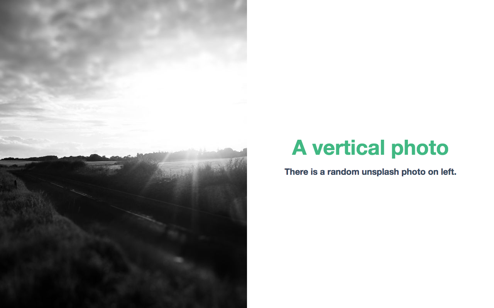

# Components

[[toc]]

## Keynote

`<Keynote>` is the root component of every presentation. You would add slides as children to this component.

```vue
<div id="app">
  <Keynote>
    <!-- Your slides here! -->
  </Keynote>
</div>
```

## Slide

`<Slide>` create an empty page in the presentation. There are different variants of slide you could use.

```vue
...
  <Slide>
    <h1>Hello World!</h1>
    <p>This is a basic slide.</p>
  </Slide>
...
```

### AuthorSlide

A slide to introduce the author. Commonly included in talks & conferences.

```vue
...
  <Author-Slide name="Author Name" photo="http://example.com/images/me.png">
    Developer, Foo Company
  </Author-Slide>
  <!-- or -->
  <Author-Slide name="Authore Name"
               photo="http://example.com/images/me.png"
               bio="Developer, Foo Company"></Author-Slide>
...
```


**Props:**

| Name  | Type   | Default | Required | Description                                                                                                                 |
| ----- | ------ | ------- | -------- | --------------------------------------------------------------------------------------------------------------------------- |
| name  | String | -       | Yes      | Title of the slide. Creates an `<h2>` element.                                                                              |
| photo | String | -       | Yes      | Title of the slide. Creates an `` element.                                                                             |
| bio   | String | `null`  | No       | Brief description about the author. Creates a `<p>` element. <br> **Contents provided to default `<slot>` overrides this.** |

### PhotoSlide

A slide with fullscreen photo.

```vue
...
  <Photo-Slide photo="http://example.com/images/random.png"></Photo-Slide>
...
```


**Props:**

| Name  | Type   | Default | Required | Description                                     |
| ----- | ------ | ------- | -------- | ----------------------------------------------- |
| photo | String | -       | Yes      | Title of the slide. Creates an `` element. |

### PhotoTitleSlide

A slide with a photo and title.

```vue
...
  <Photo-Title-Slide title="An unsplash photo"
                     photo="http://example.com/images/random.png">
    There is a random unsplash photo at top.
  </Photo-Title-Slide>
...
```


```vue
...
  <Photo-Title-Slide title="A vertical photo"
                     photo="http://example.com/images/random.png"
                     vertical>
    There is a random unsplash photo on right.
  </Photo-Title-Slide>
...
```


```vue
...
  <Photo-Title-Slide title="A vertical photo"
                     photo="http://example.com/images/random.png"
                     vertical left>
    There is a random unsplash photo on left.
  </Photo-Title-Slide>
...
```



**Props:**

| Name     | Type    | Default | Required | Description                                                                                                                   |
| -------- | ------- | ------- | -------- | ----------------------------------------------------------------------------------------------------------------------------- |
| title    | String  | -       | Yes      | Title of the slide. Creates an `<h1>` element.                                                                                |
| photo    | String  | -       | Yes      | Title of the slide. Creates an `` element.                                                                               |
| subtitle | String  | `null`  | No       | Subtitle/description for the title. Creates an `<h4>` element. <br> **Contents provided to default `<slot>` overrides this.** |
| vertical | Boolean | `false` | No       | Use vertical photo layout.                                                                                                    |
| left     | Boolean | `false` | No       | When used with `vertical`, photo is on left. In other cases, no side-effects.                                                 |

### TitleSlide

A slide with large title text centered vertically.

```vue
...
  <Title-Slide title="A Bold Title">
    A little description about it.
  </Title-Slide>
  <!-- or -->
  <Title-Slide title="A Bold Title"
               subtitle="A little description about it."></Title-Slide>
...
```


**Props:**

| Name     | Type   | Default | Required | Description                                                                                                                   |
| -------- | ------ | ------- | -------- | ----------------------------------------------------------------------------------------------------------------------------- |
| title    | String | -       | Yes      | Title of the slide. Creates an `<h1>` element.                                                                                |
| subtitle | String | `null`  | No       | Subtitle/description for the title. Creates an `<h4>` element. <br> **Contents provided to default `<slot>` overrides this.** |

## Slide Transitions

Every `<*-Slide>` component supports animations (actually transitions).

**Props:**

In addition to `<*-Slide>` component props documented above, following are also supported:

| Name                | Type   | Default | Required | Description                 |
| ------------------- | ------ | ------- | -------- | --------------------------- |
| transition          | String | -       | No       | Slide transition animation. |
| transition-duration | String | -       | No       | Duration of the animation.  |

**Available Transitions:**

* clothesline
* dissolve
* drop
* fall
* move-in
* pivot
* push
* reveal
* revolving-door
* scale
* swap
* switch
* twirl
